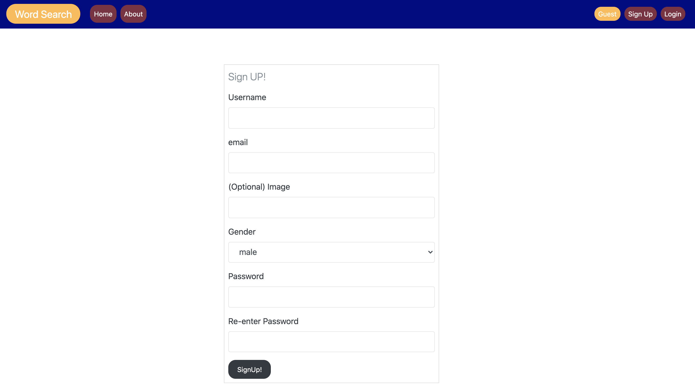

# Word Search
---------------------
## Description:-
- The word search app serves as mean to explore defenitions of
    English languages words as in an electronic dictionary,
    The app allows users to look up words, find the different defenitions
    of words, examples, synonyms and store them in a user's list.
    guest users can use the app without registering, They can only search and
    view words but can't have a list of word associated with them.

    The word search app is the first capstone project
      for https:www.springboard.com software engineering programe.
## Technologies:-
   - This app is built using the following tools:-
      - Flask for routing.
      - Flask Blueprints for organization.
      - Postgresql for storing data.
      - SqlAlchemy for mapping the database to Python.
      - WTForms for user forms.
      - Vanilla Javascript on the frontend for ajax calls and dom manipulation.
      - Bootstrap and plain css for styling.
      - Python unittest for testing.
## Live version:
- the site is hosted on the following domain:
- https://moayed-word-search.herokuapp.com/

## Visuals:-
 - Home page:

 - About page:
   
 - Login page:
    
 - Signup page:
    
 - Update user page:
    
 - Guest search page:
    
 - User search page:
    
 - User words list page:
    

## Installation:-
- To install the code locally:-
   - Create a virtual environment in the root of the project : python -m venv venv
   - Activate the virtual environment on a mac : source venv/bin/activate
   - Activate the virtual environment on windows :  venv/Scripts/activate.bat
   - Inside a virtual environment run : pip install -r requirements.txt

- Create an empty postgresql database using the following command on terminal :-
   -    createdb word-search-db
- Run seed.py on terminal using python3 seed.py to create the tables and some data.
- To run the tests files either run all tests using : python -m unittest , or python -m unittest name of the test script.py.
e.g. python -m unittest test_api.py

